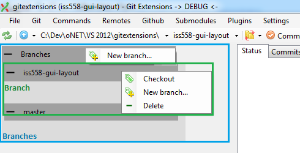
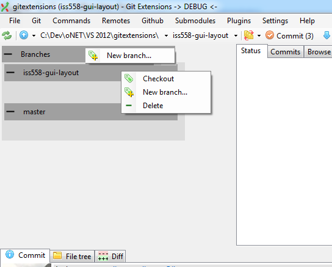
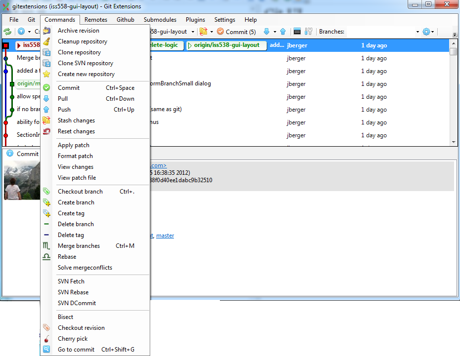

## Git Extensions UI 

Goal: apply menu commands as context actions to UI objects.

**Goal**

**Progress**

**Model UI** - from [comment in Issue 538](https://github.com/gitextensions/gitextensions/issues/538#issuecomment-9034145)

**Release UI**

